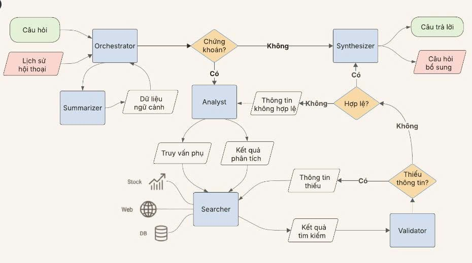

# Multi-Agent RAG System

Một hệ thống hỏi đáp tài liệu (chủ yếu lĩnh vực tài chính, cổ phiếu) sử dụng kiến trúc **multi-agent** kết hợp **RAG** (Retrieval-Augmented Generation). Hệ thống được chia thành nhiều microservice, phối hợp với nhau qua RabbitMQ, và dùng LangGraph để điều phối pipeline xử lý câu hỏi.

Nói đơn giản: bạn upload tài liệu lên, hệ thống sẽ tự cắt nhỏ, nhúng (embedding) và lưu vào vector database. Khi bạn đặt câu hỏi, một "đội ngũ" các agent AI sẽ lần lượt phân tích câu hỏi, tìm kiếm thông tin liên quan, kiểm tra chất lượng, rồi tổng hợp thành câu trả lời hoàn chỉnh.

## Kiến trúc tổng quan

```
┌───────────┐
│   Nginx   │  ← API Gateway (port 80, dùng khi chạy Docker)
└─────┬─────┘
      │
      ├────────────────────┬────────────────────┐
      ▼                    ▼                    ▼
┌───────────┐       ┌───────────┐        ┌───────────┐
│   User    │       │ Document  │        │   Chat    │
│  Service  │       │  Service  │        │  Service  │
│ (Node.js) │       │ (Node.js) │        │ (Node.js) │
│  :3004    │       │  :3001    │        │  :3003    │
└─────┬─────┘       └─────┬─────┘        └─────┬─────┘
      │                   │                    │
      │            ┌──────▼───────┐      ┌─────▼──────────┐
      │            │  Document    │      │  Orchestrator   │
      │            │  Processor   │      │  (LangGraph)    │
      │            │  (Python)    │      │  (Python)       │
      │            └──────┬───────┘      └─────┬───────────┘
      │                   │                    │
      ▼                   ▼                    ▼
┌──────────┐       ┌───────────┐        ┌───────────┐
│ MongoDB  │       │ Weaviate  │        │ RabbitMQ  │
│  :27017  │       │ (VectorDB)│        │  :5672    │
└──────────┘       │  :8080    │        └───────────┘
                   └───────────┘
```

### Các service

| Service | Công nghệ | Làm gì? |
|---------|-----------|---------|
| **User** | Node.js / Express 5 | Đăng ký, đăng nhập, xác thực JWT, Google OAuth |
| **Document** | Node.js / Express 5 | Upload / quản lý tài liệu, lưu file lên MinIO |
| **Document Processor** | Python | Nhận file từ queue, cắt chunk, tạo embedding, đẩy vào Weaviate |
| **Chat** | Node.js / Express 5 + Socket.IO | Quản lý conversation & message, gửi/nhận tin nhắn real-time |
| **Orchestrator** | Python / LangGraph | Điều phối pipeline multi-agent xử lý câu hỏi |
| **Nginx** | Nginx | Reverse proxy, chỉ dùng khi chạy full Docker |

### Multi-Agent Pipeline

Khi bạn gửi câu hỏi, hệ thống sẽ chạy qua pipeline này:



- **Receptionist** — Tiếp nhận câu hỏi, quyết định cần tra cứu tài liệu hay trả lời luôn
- **Analyst** — Phân tích câu hỏi, tách ra các truy vấn tìm kiếm cụ thể
- **Searcher** — Tìm kiếm trong Weaviate (vector search), VNStock, web
- **Validator** — Kiểm tra kết quả tìm được có đủ tốt chưa, nếu chưa thì yêu cầu tìm lại
- **Synthesizer** — Gom kết quả tìm kiếm + context, viết ra câu trả lời hoàn chỉnh
- **Summarizer** — Rút gọn/tóm tắt câu trả lời/câu hỏi/ngữ cảnh

### Infrastructure

Các service hạ tầng chạy trong Docker:

| Service | Port | Ghi chú |
|---------|------|---------|
| MongoDB | 27017 | Lưu user, conversation, message, document metadata |
| Weaviate | 8080, 50051 | Vector database lưu embedding các chunk tài liệu |
| RabbitMQ | 5672, 15672 | Message broker giữa các service. UI quản lý ở port 15672 |
| Redis | 6380 | Cache |
| MinIO | 9000, 9001 | Object storage lưu file gốc. Console ở port 9001 |

---

## Yêu cầu

Trước khi bắt đầu, đảm bảo máy bạn có:

- **Docker Desktop** — để chạy infrastructure (MongoDB, RabbitMQ, Weaviate, Redis, MinIO)
- **Node.js** >= 21 kèm npm
- **Python** >= 3.10
- **RAM** >= 8GB (16GB nếu muốn chạy mượt, vì embedding model tốn RAM)
- **Disk** >= 10GB trống
- **DEEPSEEK_API_KEY** — lấy ở [DeepSeek Platform](https://platform.deepseek.com/). Đây là key cho LLM, bắt buộc phải có

---

## Cài đặt

### 1. Clone về

```bash
git clone <repository-url>
cd multi-agent
```

### 2. Bật infrastructure lên

```bash
cd microservice
docker-compose -f docker-compose.local.yaml up -d
```

Đợi khoảng 30 giây cho RabbitMQ healthcheck xong:

```bash
docker-compose -f docker-compose.local.yaml ps   # kiểm tra tất cả đã "healthy" chưa
```

Các service hạ tầng sau khi bật:

| Service | URL |
|---------|-----|
| MongoDB | `localhost:27017` |
| Weaviate | `localhost:8080` |
| RabbitMQ | `localhost:5672` — Giao diện quản lý: http://localhost:15672 (user: `root`, pass: `Phamquan2004@`) |
| Redis | `localhost:6380` |
| MinIO | `localhost:9000` — Console: http://localhost:9001 (user: `minioadmin`, pass: `minioadmin`) |

### 3. Cài dependencies

#### Node.js services

```bash
cd microservice/user && npm install
cd ../document/node-api && npm install
cd ../../chat && npm install
```

#### Python services

```bash
# Document Processor
cd microservice/document/python-processor
pip install numpy
pip install torch --index-url https://download.pytorch.org/whl/cpu
pip install -r requirements.txt

# Tải trước model embedding (~250MB, chỉ cần 1 lần)
python -c "from sentence_transformers import SentenceTransformer; SentenceTransformer('distiluse-base-multilingual-cased-v2')"

# Orchestrator
cd ../../orchestrator
pip install protobuf==5.29.0 googleapis-common-protos
pip install -r requirements.txt
```

### 4. Cấu hình

Các file `.env` đã được tạo sẵn trong từng thư mục service, trỏ về `localhost`. Việc duy nhất bạn cần làm là **điền DEEPSEEK_API_KEY** vào 2 file:

```
microservice/orchestrator/.env
microservice/rag/.env
```

Mở ra, tìm dòng `DEEPSEEK_API_KEY=` rồi paste key thật vào.

Danh sách các file `.env`:

| File | Để làm gì |
|------|-----------|
| `microservice/user/.env` | User Service (port 3004) |
| `microservice/chat/.env` | Chat Service (port 3003) |
| `microservice/document/node-api/.env` | Document API (port 3001) |
| `microservice/document/python-processor/.env` | Document Processor |
| `microservice/orchestrator/.env` | Orchestrator — **cần DEEPSEEK_API_KEY** |
| `microservice/rag/.env` | RAG Service — **cần DEEPSEEK_API_KEY** |

### 5. Chạy

Mỗi service cần một terminal riêng:

```bash
# Terminal 1 — User Service
cd microservice/user
npm start

# Terminal 2 — Document API
cd microservice/document/node-api
npm start

# Terminal 3 — Chat Service
cd microservice/chat
npm start

# Terminal 4 — Document Processor
cd microservice/document/python-processor
python main.py

# Terminal 5 — Orchestrator
cd microservice/orchestrator
python -m src.main
```

**Hoặc dùng script cho nhanh:**

```powershell
# PowerShell
.\start-local.ps1              # chạy hết
.\start-local.ps1 infra        # chỉ infrastructure
.\start-local.ps1 services     # chỉ app services
.\start-local.ps1 stop         # dừng hết
```

```cmd
:: CMD
scripts\start-all.bat
```

### 6. Kiểm tra

Mở trình duyệt hoặc gọi API thử:

| Service | URL |
|---------|-----|
| User Service | http://localhost:3004/api/v1 |
| Document API | http://localhost:3001/api/v1 |
| Chat Service | http://localhost:3003/api/v1 |
| RabbitMQ Management | http://localhost:15672 |
| MinIO Console | http://localhost:9001 |
| Weaviate | http://localhost:8080 |

---

## Sử dụng

### Giao diện Web

Cách nhanh nhất để test là dùng giao diện web đi kèm:

```bash
npm install -g http-server      # cài 1 lần
cd frontend
http-server -p 8888 --cors -c-1
```

Mở http://localhost:8888 — giao diện hỗ trợ:
- Đăng ký / Đăng nhập
- Upload tài liệu (kéo thả hoặc chọn file — hỗ trợ PDF, TXT, DOCX, DOC)
- Quản lý cuộc hội thoại (tạo, xoá)
- Chat với AI, nhận phản hồi real-time qua Socket.IO

### Quy trình cơ bản

1. **Đăng ký / Đăng nhập** — tạo tài khoản rồi đăng nhập
2. **Upload tài liệu** — chọn file, hệ thống sẽ tự cắt chunk, tạo embedding, đẩy vào Weaviate (mất khoảng 1-5 phút tuỳ kích thước file)
3. **Tạo cuộc hội thoại** — bấm "+ Cuộc hội thoại mới"
4. **Đặt câu hỏi** — gõ câu hỏi rồi Enter. Hệ thống multi-agent sẽ tự động phân tích, tìm kiếm, kiểm tra, tổng hợp câu trả lời. Kết quả trả về real-time qua WebSocket

### API Endpoints

Nếu muốn gọi API trực tiếp (Postman, curl, ...), đây là danh sách đầy đủ:

#### Auth — User Service (port 3004)

| Method | Endpoint | Mô tả |
|--------|----------|-------|
| POST | `/api/v1/auth/register` | Đăng ký tài khoản |
| POST | `/api/v1/auth/login` | Đăng nhập, trả về JWT token |
| DELETE | `/api/v1/auth/logout` | Đăng xuất |
| PUT | `/api/v1/auth/refresh-token` | Làm mới access token |
| POST | `/api/v1/auth/sendOtp` | Gửi mã OTP |
| POST | `/api/v1/auth/verifyOtp` | Xác nhận mã OTP |
| GET | `/api/v1/auth/google` | Đăng nhập bằng Google |

#### User — User Service (port 3004)

| Method | Endpoint | Mô tả |
|--------|----------|-------|
| GET | `/api/v1/user/` | Lấy thông tin user hiện tại |
| PATCH | `/api/v1/user/update` | Cập nhật thông tin cá nhân |
| PATCH | `/api/v1/user/changePassword` | Đổi mật khẩu |
| DELETE | `/api/v1/user/delete` | Xoá tài khoản |

#### Document — Document Service (port 3001)

| Method | Endpoint | Mô tả |
|--------|----------|-------|
| POST | `/api/v1/document` | Upload tài liệu (multipart/form-data, field name: `file`) |
| GET | `/api/v1/document` | Danh sách tài liệu của user |
| GET | `/api/v1/document/:documentId` | Chi tiết một tài liệu |
| DELETE | `/api/v1/document/:documentId` | Xoá tài liệu |

#### Conversation — Chat Service (port 3003)

| Method | Endpoint | Mô tả |
|--------|----------|-------|
| POST | `/api/v1/conversation` | Tạo cuộc hội thoại mới |
| GET | `/api/v1/conversation` | Danh sách cuộc hội thoại |
| PATCH | `/api/v1/conversation/:conversationId` | Đổi tên cuộc hội thoại |
| DELETE | `/api/v1/conversation/:conversationId` | Xoá cuộc hội thoại |

#### Message — Chat Service (port 3003)

| Method | Endpoint | Mô tả |
|--------|----------|-------|
| POST | `/api/v1/message` | Gửi tin nhắn (body: `{conversationId, message}`) |
| GET | `/api/v1/message?conversationId=<id>` | Lấy tin nhắn trong cuộc hội thoại |
| PATCH | `/api/v1/message/:messageId` | Sửa tin nhắn |
| DELETE | `/api/v1/message/:messageId` | Xoá tin nhắn |

#### WebSocket (Socket.IO — port 3003)

Kết nối real-time tại `http://localhost:3003` qua Socket.IO.

| Event | Hướng | Mô tả |
|-------|-------|-------|
| `join` | Client → Server | Tham gia room conversation (gửi `conversationId`) |
| `newMessage` | Server → Client | Bot trả lời xong, nhận `{messageId, message, role}` |
| `analysis` | Server → Client | Agent đang phân tích câu hỏi (`started` / `completed`) |
| `retrieving` | Server → Client | Agent đang tìm kiếm thông tin (`started` / `completed`) |
| `summarizing` | Server → Client | Agent đang tổng hợp câu trả lời (`started` / `completed`) |

> **Xác thực**: Tất cả API (trừ login/register) đều cần gửi token qua header `Authorization: Bearer <token>`. Token lấy được khi đăng nhập.

---

## Evaluation

Dự án có sẵn bộ công cụ để đánh giá chất lượng câu trả lời của hệ thống RAG.

### Cài đặt

```bash
# Trong thư mục gốc multi-agent/
pip install -r requirements.txt
```

Tạo file `.env` ở thư mục gốc:

```env
DEEPSEEK_API_KEY=your_key_here
```

### Chạy test

```bash
python run_test_evaluation.py
```

Script sẽ đọc câu hỏi từ `test_set_ver1.json`, gửi vào hệ thống, và lưu kết quả vào thư mục `results/`.

### Đánh giá

```bash
python evaluate_results.py results/evaluation_results_<timestamp>.json
```

Các metric được tính:

| Metric | Đo cái gì |
|--------|-----------|
| Keyword Overlap | Từ khoá chung giữa câu trả lời thực tế và kỳ vọng |
| Containment | Câu trả lời kỳ vọng có nằm trong câu trả lời thực tế không |
| Faithfulness | Câu trả lời có trung thực với context được tìm thấy không |
| Answer Relevancy | Câu trả lời có liên quan đến câu hỏi không |
| Context Precision | Các đoạn context được retrieve có chất lượng không |
| Context Recall | Context đã bao phủ đủ thông tin chưa |
| Contextual Relevancy | Mức độ liên quan tổng thể của context |

Kết quả lưu tại `results/evaluation_results_<timestamp>_evaluated.json`.

---

## Cấu trúc thư mục

```
multi-agent/
├── frontend/                        # Giao diện web test
│   └── index.html
├── evaluate_results.py              # Script đánh giá
├── run_test_evaluation.py           # Script chạy test
├── test_set_ver1.json               # Bộ test (câu hỏi + đáp án kỳ vọng)
├── requirements.txt                 # Dependencies cho evaluation
├── start-local.ps1                  # Script chạy local (PowerShell)
├── scripts/                         # Batch scripts
├── results/                         # Kết quả evaluation
│
└── microservice/
    ├── docker-compose.yaml          # Docker full (production)
    ├── docker-compose.local.yaml    # Docker chỉ infrastructure
    ├── cors.json                    # Cấu hình CORS cho MinIO
    ├── nginx/                       # Reverse proxy (chỉ dùng Docker mode)
    │
    ├── user/                        # User Service
    │   ├── .env
    │   └── src/
    │       ├── controllers/         # authController, userController
    │       ├── models/              # userModel
    │       ├── routes/              # authRoutes, userRoutes
    │       └── middlewares/         # JWT auth middleware
    │
    ├── document/
    │   ├── node-api/                # Document API
    │   │   ├── .env
    │   │   └── src/
    │   └── python-processor/        # Document Processor
    │       ├── .env
    │       ├── handler/             # create, delete handlers
    │       ├── services/            # documentService, searchService
    │       └── utils/               # chunking, embedding
    │
    ├── chat/                        # Chat Service
    │   ├── .env
    │   └── src/
    │       ├── controllers/         # conversationController, messageController
    │       ├── config/socket.js     # Socket.IO setup
    │       └── workers/             # messagePublisher, responseConsumer
    │
    ├── orchestrator/                # Multi-Agent Orchestrator
    │   ├── .env
    │   └── src/
    │       ├── graph.py             # LangGraph workflow
    │       ├── agents/              # receptionist, analyst, searcher, validator, synthesizer, summarizer
    │       └── utils/               # RabbitMQ, vector DB helpers
    │
    └── rag/                         # RAG Service (standalone)
        ├── .env
        └── handler/
```

---

## Dừng hệ thống

```bash
# Dừng infrastructure
cd microservice
docker-compose -f docker-compose.local.yaml down

# Muốn xoá sạch data luôn thì thêm -v
docker-compose -f docker-compose.local.yaml down -v
```

Các app service: `Ctrl+C` trong terminal tương ứng, hoặc:

```powershell
.\start-local.ps1 stop
```

---

## Gặp lỗi?

| Lỗi | Cách xử lý |
|-----|-------------|
| RabbitMQ chưa sẵn sàng | Đợi ~30 giây cho healthcheck xong. Kiểm tra: `docker-compose -f docker-compose.local.yaml logs rabbitmq` |
| `DEEPSEEK_API_KEY` lỗi | Kiểm tra đã paste key thật vào `orchestrator/.env` chưa |
| Document Processor crash | RAM không đủ cho embedding model. Cần tối thiểu ~2GB RAM trống |
| Không kết nối được MongoDB | Kiểm tra Docker container `mongo` đang chạy, và `MONGO_URI` trong `.env` có `authSource=admin` |
| Upload tài liệu lỗi | Vào MinIO Console (http://localhost:9001) kiểm tra bucket đã tạo chưa |
| Weaviate timeout | Đợi Weaviate khởi động xong, test thử `http://localhost:8080/v1/.well-known/ready` |
| `npm start` báo module not found | Chạy `npm install` trong thư mục service đó |
| Python ImportError | Chạy `pip install -r requirements.txt` trong thư mục service đó |
| Port bị chiếm | Kiểm tra `netstat -ano \| findstr :<port>` rồi tắt process đang dùng |
| Frontend không gửi được tin nhắn | Mở DevTools (F12) → Console, kiểm tra lỗi. Đảm bảo tất cả service đều đang chạy |
